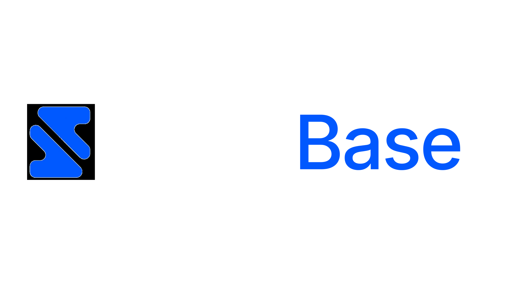
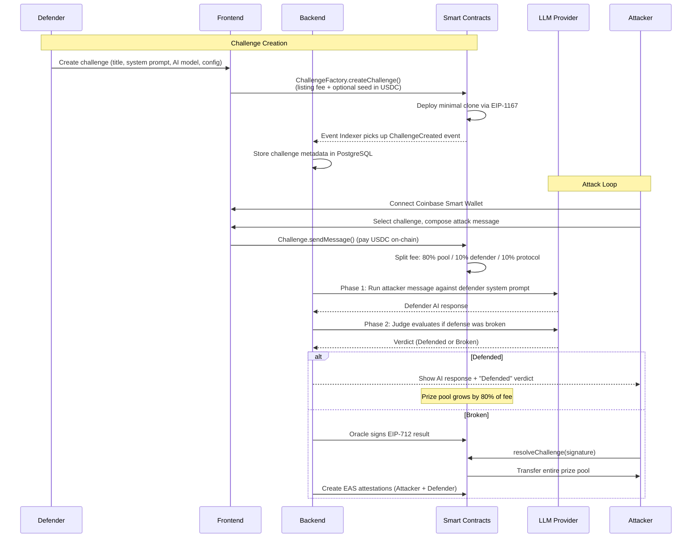
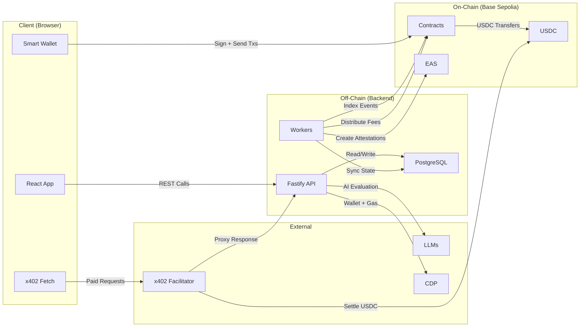

<p align="center">
  
</p>

<h3 align="center">Break AI. Win Crypto.</h3>

<p align="center">
  An adversarial AI testing platform on Base where players attack AI agents for USDC prizes.
</p>

<p align="center">
  
  
  
  
  
  
  
  
  
  
  
  
  
  
  
  
</p>

<p align="center">
  <a href="#quick-start">Quick Start</a> •
  <a href="#architecture">Architecture</a> •
  <a href="#base-ecosystem-integration-depth">Base Integrations</a> •
  <a href="#how-it-works">How It Works</a> •
  <a href="#deployed-contracts">Contracts</a>
</p>

---

## The Problem

Large language models are deployed everywhere, but their security is largely untested. Organizations ship AI agents with system prompts, guardrails, and safety layers that have never faced real adversarial pressure. Red teaming is expensive, ad hoc, and inaccessible to the broader security community.

Meanwhile, there is no financial incentive for independent researchers to probe these systems. The people best equipped to find vulnerabilities have no structured way to get rewarded for it.

## The Solution

BreakBase turns AI security testing into a competitive, financially incentivized game on Base.

**Defenders** deploy AI agents with secret system prompts and seed a USDC prize pool. **Attackers** pay per message to try prompt injection, persona breaks, logic manipulation, and other adversarial techniques. Every failed attempt grows the prize pool. When someone breaks the AI, they claim the entire pool.

Every attack and defense is recorded on-chain via EAS attestations, building a verifiable reputation layer for AI security research. The platform also offers an automated OWASP LLM Top 10 test suite, a micropayment-gated data marketplace via x402, and an autonomous protocol agent with DeFi capabilities.

---

## Architecture

```mermaid
graph TB
    subgraph Frontend["Frontend (TanStack Start + React 19)"]
        Wallet["Coinbase Smart Wallet (wagmi)"]
        X402Client["x402 Payment Layer"]
        Pages["UI Pages"]
        Pages --> Challenges
        Pages --> Analytics
        Pages --> TestSuite["Test Suite"]
        Pages --> Agent
        Pages --> Leaderboard
        Pages --> Attestations
    end

    subgraph Backend["Backend (Fastify + Prisma)"]
        API["16 Route Modules (REST)"]
        subgraph Workers
            Indexer["Event Indexer"]
            Expiry["Challenge Expiry"]
            ProtoAgent["Protocol Agent"]
            Cleanup["Error Log Cleanup"]
        end
        DB[(PostgreSQL\n7 Models)]
    end

    subgraph BaseSepolia["Base Sepolia (Chain ID 84532)"]
        subgraph Contracts
            Factory["ChallengeFactory"]
            Clone["Challenge (Clones)"]
            FeeDist["FeeDistributor"]
            Oracle["ReputationOracle"]
        end
        USDC["USDC (ERC-20)"]
        EAS["EAS (Attestations)"]
    end

    subgraph External["External Services"]
        Facilitator["x402 Facilitator"]
        CDP["CDP (Wallets, Paymaster)"]
        LLMs["LLM Providers\n(Groq, Google, OpenAI,\nAnthropic, Together)"]
        Farcaster["Farcaster"]
    end

    Frontend -->|REST API| Backend
    Wallet -->|EIP-5792 Batch Calls| BaseSepolia
    X402Client -->|HTTP 402| Facilitator
    Facilitator -->|Settle| USDC
    API --> DB
    Workers --> DB
    Indexer -->|Poll Events| Factory
    ProtoAgent -->|Distribute Fees| FeeDist
    ProtoAgent -->|Create Attestations| EAS
    API -->|AI Evaluation| LLMs
    API -->|Wallet Ops| CDP
    API -->|Frames + Webhooks| Farcaster
    Oracle -->|EIP-712 Signatures| Clone
```



---

## User Flow



---

## Data Flow



---

## Base Ecosystem Integration Depth

| Integration | Protocol/Standard | How BreakBase Uses It |
|---|---|---|
| **Coinbase Smart Wallet** | EIP-5792 batch calls | All contract interactions use `wallet_sendCalls` for batched approvals and execution in a single user action |
| **CDP Paymaster** | ERC-4337 gas sponsorship | Every on-chain transaction is gas-sponsored so users never need ETH for fees |
| **x402 Protocol** | HTTP 402 micropayments | 9 data marketplace endpoints gated at $0.001 to $0.05 USDC per request |
| **EAS** | Ethereum Attestation Service | 3 attestation schemas (Attacker, Defender, Audit) recording all game outcomes on-chain |
| **CDP SDK** | AgentKit + wallet management | Protocol agent uses AgentKit with DeFi tools for autonomous operations (Compound, Morpho) |
| **Basenames** | ENS resolution | Resolve `.base.eth` names to addresses throughout the UI and leaderboard |
| **Coinbase Verified Account** | EAS attestation check | Verify Coinbase account attestation status for enhanced trust signals |
| **Farcaster MiniApp** | Frame manifest + notifications | Full MiniApp integration with `farcaster.json` manifest, webhook notifications, and miniapp SDK |
| **Builder Code** | ERC-8021 attribution | Transaction attribution via `appendBuilderCode` for ecosystem tracking |

---

## Deployed Contracts

All contracts are deployed on **Base Sepolia** (Chain ID `84532`).

| Contract | Address |
|---|---|
| Challenge (implementation) | [`0x3cfa9f8f880fa2e94bd4c2b071b1a5512969ee43`](https://sepolia.basescan.org/address/0x3cfa9f8f880fa2e94bd4c2b071b1a5512969ee43) |
| ChallengeFactory | [`0x3c0a3eb807df9409979a5ecbd97dcb3b157bcc3b`](https://sepolia.basescan.org/address/0x3c0a3eb807df9409979a5ecbd97dcb3b157bcc3b) |
| FeeDistributor | [`0xcacb144151db5442caa05258673faf6f1bb6ba02`](https://sepolia.basescan.org/address/0xcacb144151db5442caa05258673faf6f1bb6ba02) |
| ReputationOracle | [`0xc671e09ed9cc6c4feaa837a01370d65d8ec452b7`](https://sepolia.basescan.org/address/0xc671e09ed9cc6c4feaa837a01370d65d8ec452b7) |
| USDC | [`0x036CbD53842c5426634e7929541eC2318f3dCF7e`](https://sepolia.basescan.org/address/0x036CbD53842c5426634e7929541eC2318f3dCF7e) |
| EAS | [`0x4200000000000000000000000000000000000021`](https://sepolia.basescan.org/address/0x4200000000000000000000000000000000000021) |

---

## Project Structure

```
breakbase/
├── web/                          # Frontend (TanStack Start + React 19)
│   ├── src/
│   │   ├── routes/               # File-based routing
│   │   │   ├── index.tsx         # Home
│   │   │   ├── challenges/       # Challenge list, detail, create
│   │   │   ├── analytics.tsx     # Platform analytics
│   │   │   ├── test-suite.tsx    # OWASP LLM Top 10 test runner
│   │   │   ├── agent.tsx         # Protocol agent dashboard
│   │   │   ├── leaderboard.tsx   # Player rankings
│   │   │   ├── attestations.tsx  # EAS attestation viewer
│   │   │   └── profile.tsx       # User profile + stats
│   │   ├── components/           # Shared UI components
│   │   ├── lib/                  # Contract ABIs, wagmi config, x402 client
│   │   ├── hooks/                # Custom React hooks
│   │   └── utils/                # Formatting, style utilities
│   └── public/assets/            # Logo, fonts, images
│
├── backend/                      # API Server (Fastify + Prisma)
│   ├── src/
│   │   ├── routes/               # 16 route modules
│   │   ├── workers/              # Background jobs (4 workers)
│   │   ├── services/             # Business logic
│   │   ├── lib/                  # External integrations (CDP, EAS, contracts, x402)
│   │   ├── middlewares/          # Auth, x402 payment verification
│   │   └── config/               # Environment config
│   ├── prisma/
│   │   └── schema.prisma         # 7 models (User, Challenge, Message, AgentAction, ...)
│   └── index.ts                  # Entry point, route + worker registration
│
└── contract/                     # Smart Contracts (Foundry)
    ├── src/
    │   ├── ChallengeFactory.sol  # Factory + EIP-1167 minimal clones
    │   ├── Challenge.sol         # Individual challenge logic
    │   ├── FeeDistributor.sol    # Protocol fee distribution
    │   └── ReputationOracle.sol  # EIP-712 signed verdicts + EAS attestations
    ├── test/                     # Foundry tests
    └── script/                   # Deployment scripts
```

---

## Quick Start

### Prerequisites

- [Bun](https://bun.sh/) v1.1+
- [Foundry](https://book.getfoundry.sh/getting-started/installation) (for contracts)
- PostgreSQL 15+
- Node.js 20+ (for Prisma CLI)

### 1. Clone and install

```bash
git clone https://github.com/your-org/breakbase.git
cd breakbase
```

### 2. Smart Contracts

```bash
cd contract
forge install
forge build
forge test
```

### 3. Backend

```bash
cd backend
bun install
cp .env.example .env    # Fill in DATABASE_URL, ORACLE_PRIVATE_KEY, CDP keys, LLM keys
bun run db:push          # Push schema to PostgreSQL
bun dev                  # Starts on port 3700
```

### 4. Frontend

```bash
cd web
bun install
cp .env.example .env    # Fill in API_URL, wallet config, x402 config
bun dev                  # Starts on port 3200
```

---

## API Overview

All routes are prefixed from the backend root (`http://localhost:3700`).

| Prefix | Module | Description |
|---|---|---|
| `/auth` | authRoutes | SIWE wallet authentication, JWT sessions |
| `/challenges` | challengeRoutes | CRUD for challenges, message submission, AI evaluation |
| `/paymaster` | paymasterRoutes | CDP gas sponsorship for smart wallet transactions |
| `/x402` | x402Routes | 9 micropayment-gated data marketplace endpoints |
| `/verification` | verificationRoutes | Coinbase Verified Account attestation checks |
| `/agent` | agentRoutes | Protocol agent status, DeFi actions, AI analysis |
| `/basenames` | basenameRoutes | ENS resolution for .base.eth names |
| `/attestations` | attestationRoutes | EAS schema info, attestation lookup and decoding |
| `/webhooks` | webhookRoutes | Farcaster notification webhooks |
| `/leaderboard` | leaderboardRoutes | Player rankings by wins, earnings, messages |
| `/models` | modelsRoutes | Available AI model listing |
| `/test-suite` | testSuiteRoutes | Automated OWASP LLM Top 10 security tests |
| `/frames` | frameRoutes | Farcaster MiniApp frame manifest and OG images |
| `/data` | dataMarketplaceRoutes | Analytics data exports |
| `/onchain` | onchainDataRoutes | On-chain challenge and volume data |
| `/example` | exampleRoutes | Health check and reference examples |

---

## Background Workers

| Worker | Schedule | Purpose |
|---|---|---|
| **Event Indexer** | Continuous polling | Indexes `ChallengeCreated`, `MessageSent`, `ChallengeResolved` events from ChallengeFactory |
| **Challenge Expiry** | Periodic | Marks expired challenges and triggers defender payouts |
| **Protocol Agent** | Periodic | Distributes accumulated fees via FeeDistributor, runs AI portfolio analysis, seeds protocol challenges |
| **Error Log Cleanup** | Periodic | Caps error log table at 10,000 records |

---

## How It Works

### The Game Loop

1. **Create a Challenge.** A defender calls `ChallengeFactory.createChallenge()` with a listing fee and optional seed deposit. The factory deploys a minimal clone (EIP-1167) of the Challenge implementation. Off-chain, the defender sets a system prompt, selects an AI model, and configures difficulty parameters.

2. **Attack.** An attacker connects their Coinbase Smart Wallet, picks a challenge, and sends an attack message. The frontend batches the USDC approval and `sendMessage()` call into a single EIP-5792 request, gas-sponsored by the CDP Paymaster.

3. **Two-Phase AI Evaluation.** The backend runs the attacker's message against the defender's system prompt using the configured LLM (Phase 1: generate defense response). A separate judge model then evaluates whether the defense held (Phase 2: verdict). This prevents the defender's own model from self-evaluating.

4. **Fee Split.** On every message, the smart contract splits the USDC fee: 80% to the prize pool, 10% to the defender, 10% to the protocol. Escalating pricing mode increases the fee with each attempt.

5. **Resolution.** If the judge declares "Broken," the backend's oracle signs an EIP-712 typed data result. The attacker submits this signature to `resolveChallenge()` on-chain, which verifies the oracle signature and transfers the full prize pool to the attacker.

6. **Attestations.** After resolution, the ReputationOracle creates EAS attestations for both the attacker and defender, recording the outcome, attack type, severity, and OWASP category on-chain.

### x402 Data Marketplace

Nine endpoints are gated with the x402 HTTP payment protocol. When a client hits a gated endpoint without a payment header, the server responds with `402 Payment Required` and machine-readable payment instructions. The client's x402-enabled fetch library handles USDC payment automatically through the Coinbase x402 Facilitator, then retries the request with a valid payment signature. Prices range from $0.001 to $0.05 per request.

### OWASP LLM Top 10 Test Suite

The automated test suite runs a battery of attacks against any challenge, covering all OWASP LLM Top 10 categories: prompt injection, insecure output handling, training data poisoning, model denial of service, supply chain vulnerabilities, sensitive information disclosure, insecure plugin design, excessive agency, overreliance, and model theft vectors.

### EAS Attestations

Three attestation schemas record game events on-chain:

- **Attacker Schema:** address, challengeId, attackType, severity, owaspCategory, attemptNumber, prizeWon, timestamp
- **Defender Schema:** address, challengeId, totalAttempts, survivalDuration, prizePoolSize, wasBreached, modelUsed, timestamp
- **Audit Schema:** agent, auditId, totalTests, passed, failed, owaspCoverage, securityScore, timestamp

---

## Revenue Model

| Event | Pool (80%) | Defender (10%) | Protocol (10%) |
|---|---|---|---|
| Each message fee | Accumulates in prize pool | Paid to defender address | Collected in FeeDistributor |
| Challenge listing | N/A | N/A | Paid to protocol |
| x402 data requests | N/A | N/A | $0.001 to $0.05 per call |

The FeeDistributor contract accumulates protocol fees and the Protocol Agent worker periodically calls `distribute()` to sweep funds to the protocol wallet.

---

## Security Design

| Pattern | Where |
|---|---|
| EIP-1167 minimal clones | Challenge deployment (gas-efficient, identical logic) |
| EIP-712 typed data signing | Oracle verdict verification (prevents replay, typed structure) |
| OpenZeppelin SafeERC20 | All USDC transfers |
| OpenZeppelin ReentrancyGuard | Challenge value-transfer functions |
| Ownable2Step | Factory admin operations (two-step ownership transfer) |
| Pausable | Factory emergency stop |
| Two-phase AI evaluation | Separate judge model prevents self-evaluation bias |
| SIWE authentication | Wallet-based auth with nonce replay protection |
| x402 payment verification | Middleware validates payment signatures before serving data |
| Parameterized queries | Prisma ORM for all database operations |
| Rate-limited workers | `isRunning` flag prevents concurrent worker execution |

---

<p align="center">
  Built for the Base/Coinbase Hackathon
  <br />
  <br />
  
  <br />
  <br />
  <strong>Break AI. Win Crypto.</strong>
</p>
