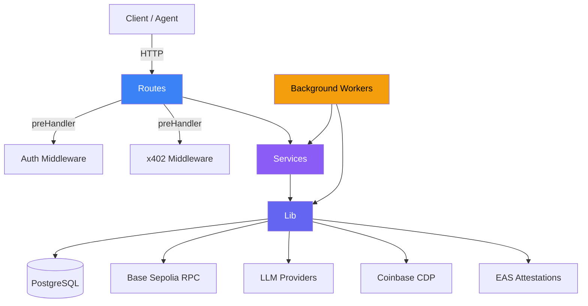
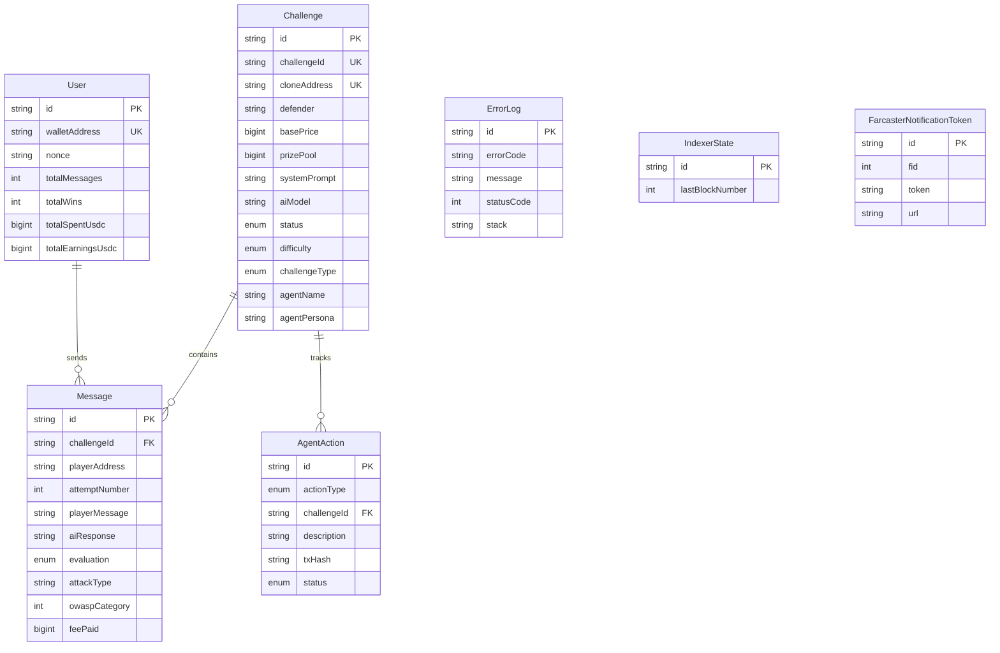
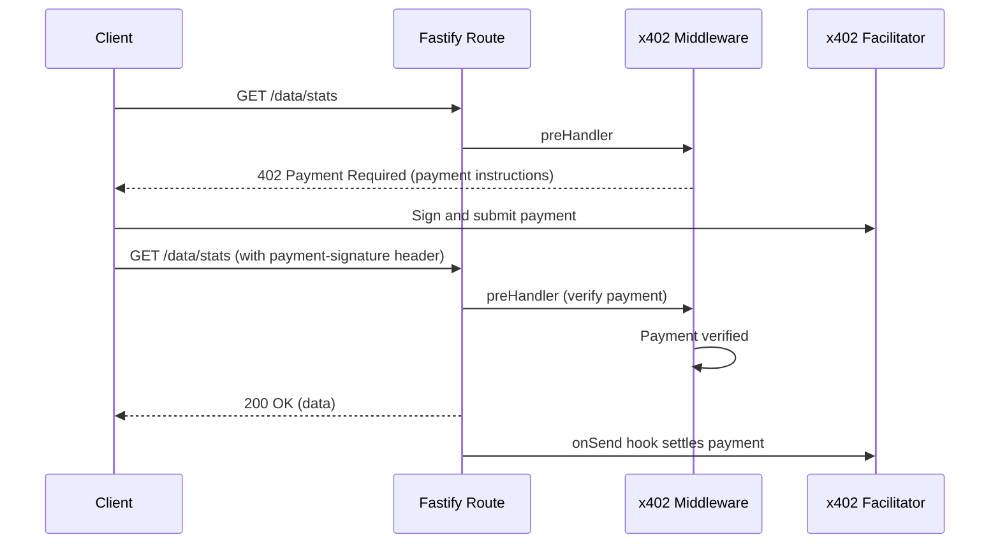
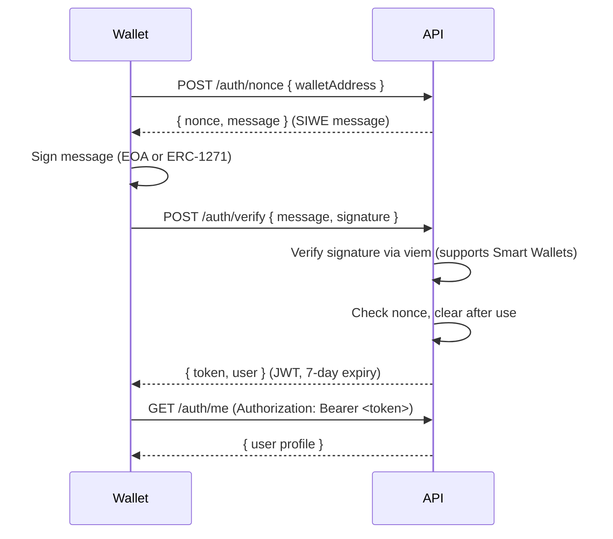

# BreakBase Backend

AI adversarial testing platform API server. Break AI systems, earn USDC on Base Sepolia.


## Architecture



**Layers:**

| Layer | Path | Responsibility |
|-------|------|----------------|
| Routes | `src/routes/` | HTTP handlers, input validation, response formatting |
| Middlewares | `src/middlewares/` | JWT auth, x402 payment gating |
| Services | `src/services/` | Business logic (AI evaluation, oracle signing, attack battery) |
| Lib | `src/lib/` | External integrations (Prisma, contracts, CDP, EAS, Farcaster, AI) |
| Workers | `src/workers/` | Cron jobs and background tasks |
| Config | `src/config/` | Centralized environment variable management |

## Quick Start

```bash
bun install
cp .env.example .env  # fill in required vars
bun run db:push
bun dev
```

The server starts on port `3700` by default. Health check: `GET /`.

## Environment Variables

### Required

| Variable | Description |
|----------|-------------|
| `DATABASE_URL` | PostgreSQL connection string |
| `JWT_SECRET` | Secret for signing JWT tokens |
| `RPC_URL` | Base Sepolia JSON-RPC endpoint |
| `ORACLE_PRIVATE_KEY` | Private key for the EIP-712 oracle signer |

### Contracts

| Variable | Description |
|----------|-------------|
| `CHALLENGE_FACTORY_ADDRESS` | Deployed ChallengeFactory contract address |
| `FEE_DISTRIBUTOR_ADDRESS` | Deployed FeeDistributor contract address |

### AI Providers

At least one provider key is needed. Priority: Groq > Google > OpenAI > Together > Anthropic.

| Variable | Description |
|----------|-------------|
| `ANTHROPIC_API_KEY` | Anthropic API key |
| `OPENAI_API_KEY` | OpenAI API key |
| `GOOGLE_GENERATIVE_AI_API_KEY` | Google Generative AI key |
| `TOGETHER_API_KEY` | Together AI key |
| `GROQ_API_KEY` | Groq API key |

### Coinbase Developer Platform (CDP)

| Variable | Description |
|----------|-------------|
| `CDP_API_KEY_ID` | CDP API key identifier |
| `CDP_API_KEY_SECRET` | CDP API key secret |
| `CDP_WALLET_SECRET` | CDP wallet encryption secret |
| `CDP_AGENT_ADDRESS` | Protocol agent wallet address |
| `CDP_PAYMASTER_URL` | Paymaster RPC URL (auto-derived from key ID if omitted) |
| `CDP_WEBHOOK_SECRET` | Svix signing secret for CDP webhook verification |

### EAS (Ethereum Attestation Service)

| Variable | Description |
|----------|-------------|
| `ATTACKER_SCHEMA_UID` | EAS schema UID for attacker attestations |
| `DEFENDER_SCHEMA_UID` | EAS schema UID for defender attestations |
| `AUDIT_SCHEMA_UID` | EAS schema UID for audit attestations |
| `REPUTATION_ORACLE_ADDRESS` | ReputationOracle contract address |
| `CB_VERIFIED_SCHEMA_UID` | Coinbase Verified Account EAS schema UID |

### x402 Payment Protocol

| Variable | Description |
|----------|-------------|
| `X402_FACILITATOR_URL` | Facilitator URL (default: `https://x402.org/facilitator`) |
| `X402_PAY_TO_ADDRESS` | Wallet receiving x402 micropayments |

### Farcaster

| Variable | Description |
|----------|-------------|
| `NEYNAR_API_KEY` | Neynar API key for Farcaster integration |
| `NEYNAR_MANAGER_SIGNER` | Neynar managed signer UUID |
| `AGENT_FID` | Farcaster ID for the protocol agent |

### Other

| Variable | Default | Description |
|----------|---------|-------------|
| `APP_URL` | `http://localhost:3000` | Frontend URL |
| `API_URL` | `http://localhost:3700` | Backend API URL |
| `CHAIN_ID` | `84532` | Target chain ID (Base Sepolia) |
| `DEFAULT_AI_MODEL` | `anthropic:claude-sonnet-4-20250514` | Default model for challenge defenders |
| `JUDGE_AI_MODEL` | (auto-selected) | Model used for evaluation judging |
| `ADMIN_API_KEY` | | Key for admin-only endpoints |
| `APP_PORT` | `3700` | Server listen port |

## API Routes

### Public Endpoints

| Prefix | Module | Key Endpoints | Description |
|--------|--------|---------------|-------------|
| `/` | `index.ts` | `GET /` | Health check |
| `/auth` | `authRoutes` | `POST /nonce`, `POST /verify` | SIWE authentication |
| `/challenges` | `challengeRoutes` | `GET /`, `GET /:id`, `GET /:id/fee` | Browse challenges, get fee info |
| `/leaderboard` | `leaderboardRoutes` | `GET /` | Ranked players by wins/messages/earnings |
| `/models` | `modelsRoutes` | `GET /` | Available LLM models |
| `/basenames` | `basenameRoutes` | `GET /resolve/:address`, `POST /batch` | Base name resolution |
| `/verification` | `verificationRoutes` | `GET /:address` | Coinbase Verified Account check |
| `/attestations` | `attestationRoutes` | `GET /schemas`, `GET /:uid` | EAS schema info, attestation lookup |
| `/frames` | `frameRoutes` | `GET /`, `GET /og`, `GET /manifest`, `POST /webhook` | Farcaster Frame/MiniApp |
| `/agent` | `agentRoutes` | `GET /status`, `GET /profile`, `GET /actions`, `GET /chat/config` | Agent status and public info |
| `/x402` | `x402Routes` | `GET /catalog` | x402 endpoint discovery |

### Authenticated Endpoints (JWT)

| Prefix | Key Endpoints | Description |
|--------|---------------|-------------|
| `/auth` | `GET /me` | Current user profile |
| `/challenges` | `POST /`, `POST /:id/messages` | Create challenge, submit attack message |
| `/agent` | `POST /policies/init`, `GET /policies` | CDP policy management |
| `/attestations` | `POST /register-schemas` | One-time schema registration (admin) |

### x402 Payment-Gated Endpoints

| Endpoint | Method | Price (USDC) | Description |
|----------|--------|-------------|-------------|
| `/x402/challenge-insights/:id` | GET | $0.01 | AI evaluation analytics for a challenge |
| `/data/stats` | GET | $0.001 | Aggregate platform statistics |
| `/data/attacks/:owaspCategory` | GET | $0.01 | Attack patterns by OWASP category |
| `/data/models` | GET | $0.01 | Model defense comparison data |
| `/data/trends` | GET | $0.05 | 30-day time-series trend data |
| `/test-suite/run` | POST | $0.05 | Automated attack battery run |
| `/onchain/challenges` | GET | $0.01 | Recent on-chain challenge events |
| `/onchain/volume/:address` | GET | $0.01 | USDC volume analytics |
| `/onchain/activity/:address` | GET | $0.01 | Transaction activity analytics |
| `/agent/chat` | POST | $0.10 | Chat with the protocol agent |

### Infrastructure Endpoints

| Prefix | Key Endpoints | Description |
|--------|---------------|-------------|
| `/paymaster` | `POST /` | JSON-RPC proxy to CDP paymaster/bundler |
| `/webhooks` | `POST /cdp`, `GET /health` | CDP webhook receiver |

## Background Workers

| Worker | Schedule | Description |
|--------|----------|-------------|
| Event Indexer | Every 15s (polling) | Indexes `ChallengeCreated` events from the factory contract, syncs challenge state |
| Challenge Expiry | Every 5 min (cron) | Expires challenges past their `endTime + 1h` grace period, calls `expireChallenge()` on-chain |
| Protocol Agent | Every 10 min (cron) | Distributes fees via FeeDistributor, seeds house challenges, runs AI platform analysis |
| Error Log Cleanup | Every hour (cron) | Caps `ErrorLog` table at 10,000 records, deletes oldest entries |

## Services

| Service | File | Description |
|---------|------|-------------|
| AI Evaluation | `aiEvaluationService.ts` | Generates defender responses and runs a judge model to classify attacks (OWASP LLM Top 10) |
| Oracle | `oracleService.ts` | Signs EIP-712 `ChallengeResult` messages for on-chain resolution |
| Attack Battery | `attackBatteryService.ts` | Runs a library of predefined attack prompts to produce a security score (0-100) |
| Challenge Seeding | `challengeSeedingService.ts` | Creates protocol "house challenges" via the CDP agent wallet |

## Database Schema



**Enums:**

| Enum | Values |
|------|--------|
| `ChallengeStatus` | Active, Resolved, Expired, Cancelled |
| `PricingModel` | Fixed, Escalating |
| `Difficulty` | Easy, Medium, Hard, Expert |
| `EvaluationResult` | Defended, Broken, Error |
| `ChallengeType` | SecretExtraction, PersonaBreak, SystemPromptLeak, FunctionAbuse, LogicManipulation, ContextPoisoning, MultiTurnErosion, AgentEscape, Custom |
| `AgentActionType` | FeeDistribution, ChallengeSeeded, PrizePoolSeeded, AttestationCreated, Other |
| `ActionStatus` | Pending, Success, Failed |

## AI Provider Support

Models are registered through the Vercel AI SDK provider registry. Only providers with configured API keys are loaded.

| Provider | Model ID | Display Name | Context Window |
|----------|----------|-------------|----------------|
| Groq | `groq:llama-3.3-70b-versatile` | Llama 3.3 70B | 128K |
| Groq | `groq:llama-3.1-8b-instant` | Llama 3.1 8B | 128K |
| Groq | `groq:gemma2-9b-it` | Gemma 2 9B | 8K |
| Google | `google:gemini-2.5-flash` | Gemini 2.5 Flash | 1M |
| OpenAI | `openai:gpt-4o` | GPT-4o | 128K |
| OpenAI | `openai:gpt-4.1-mini` | GPT-4.1 Mini | 1M |
| Together | `togetherai:meta-llama/Llama-4-Maverick-17B-128E-Instruct-FP8` | Llama 4 Maverick | 128K |
| Anthropic | `anthropic:claude-sonnet-4-20250514` | Claude Sonnet 4 | 200K |
| Anthropic | `anthropic:claude-haiku-4-5` | Claude Haiku 4.5 | 200K |

The judge model is automatically selected from a different provider than the defender to avoid self-evaluation bias.

## x402 Payment Integration

The x402 protocol (HTTP 402) gates endpoints behind USDC micropayments on Base Sepolia.



**Key components:**

- `createX402PreHandler(config)` creates a Fastify preHandler that returns 402 with payment instructions when no valid payment header is present
- `registerX402SettlementHook(app)` adds an `onSend` hook that settles verified payments after the route handler responds
- The `GET /x402/catalog` endpoint provides machine-readable discovery of all payment-gated endpoints with pricing

## Authentication

SIWE (Sign-In With Ethereum) with ERC-1271 Smart Wallet support.



Protected routes use `authMiddleware` as a Fastify preHandler. The middleware verifies the JWT, loads the user from the database, and attaches it to `request.user`.

## Scripts

| Script | Command | Description |
|--------|---------|-------------|
| `start` | `bun index.ts` | Start production server |
| `dev` | `bun --watch index.ts` | Start with file watching |
| `lint` | `eslint . --ext .ts` | Run ESLint |
| `typecheck` | `tsc --noEmit` | Type check without emitting |
| `db:push` | `bunx prisma db push` | Push schema to database and regenerate client |
| `db:pull` | `bunx prisma db pull` | Pull schema from database |
| `db:generate` | `bunx prisma generate` | Regenerate Prisma client |
| `db:migrate` | `bunx prisma migrate dev` | Create and run migration |

## Project Structure

```
src/
  config/
    main-config.ts            # Centralized env vars (validates required on startup)
  lib/
    ai/
      registry.ts             # Multi-provider LLM registry (Vercel AI SDK)
    attacks/
      attackPrompts.ts        # Predefined attack prompt library
    basenames/
      basenameService.ts      # Base name resolution (ENS on Base)
    cdp/
      agentKitService.ts      # Coinbase AgentKit integration
      policyService.ts        # CDP wallet policy management
      sqlService.ts           # CDP SQL API client
      walletService.ts        # CDP wallet operations
      webhookManager.ts       # CDP webhook management
    contracts/
      abis/                   # Contract ABIs (Challenge, Factory, FeeDistributor, Oracle)
      contractService.ts      # Contract read/write helpers
      viemClient.ts           # Viem public client
    eas/
      attestationService.ts   # EAS attestation creation (attacker, defender, audit)
      coinbaseVerification.ts # Coinbase Verified Account check
    farcaster/
      notificationService.ts  # Farcaster notification token storage and sending
    x402/
      bazaarMetadata.ts       # x402 Bazaar discovery metadata
      x402Service.ts          # x402 resource server factory
    builderCode.ts            # ERC-8021 builder code injection
    prisma.ts                 # Prisma client singleton
  middlewares/
    authMiddleware.ts         # JWT verification, user loading
    x402Middleware.ts          # x402 payment verification and settlement
  routes/
    agentRoutes.ts            # CDP agent status, chat, actions, analysis
    attestationRoutes.ts      # EAS schema management, attestation lookup
    authRoutes.ts             # SIWE nonce, verify, profile
    basenameRoutes.ts         # Address-to-basename resolution
    challengeRoutes.ts        # CRUD challenges, submit messages, get fees
    dataMarketplaceRoutes.ts  # x402-gated aggregate data (stats, attacks, models, trends)
    frameRoutes.ts            # Farcaster Frame embed, OG image, MiniApp manifest
    leaderboardRoutes.ts      # Player rankings
    modelsRoutes.ts           # Available AI models
    onchainDataRoutes.ts      # x402-gated on-chain analytics
    paymasterRoutes.ts        # JSON-RPC proxy to CDP paymaster
    testSuiteRoutes.ts        # x402-gated automated attack battery
    verificationRoutes.ts     # Coinbase Verified Account status
    webhookRoutes.ts          # CDP webhook receiver
    x402Routes.ts             # Challenge insights, x402 catalog
  services/
    aiEvaluationService.ts    # Defender response + judge evaluation
    attackBatteryService.ts   # Automated multi-prompt security testing
    challengeSeedingService.ts # Protocol house challenge creation
    oracleService.ts          # EIP-712 oracle signing
  types/
    index.ts                  # Shared TypeScript types and enums
  utils/
    errorHandler.ts           # Centralized error responses + DB logging
    miscUtils.ts              # Random IDs, address shortening, sleep
    timeUtils.ts              # Timestamp helpers
    validationUtils.ts        # Request body field validation
  workers/
    challengeExpiry.ts        # Expire overdue challenges on-chain
    errorLogCleanup.ts        # Cap error log table size
    eventIndexer.ts           # Index factory events from Base Sepolia
    protocolAgent.ts          # Fee distribution, seeding, AI analysis
```
