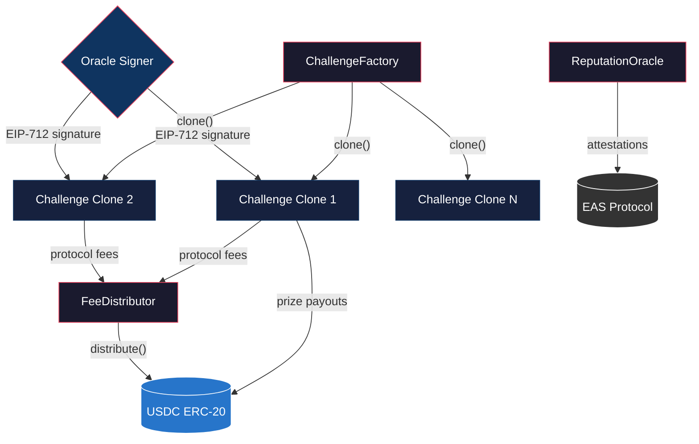
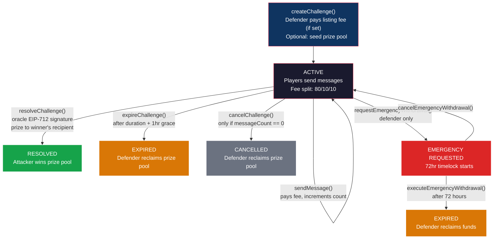

# BreakBase Smart Contracts

On-chain challenge infrastructure for adversarial AI security testing. Players pay to send messages attempting to break AI agents; prizes go to successful attackers.


## Architecture

Each challenge is a minimal clone (EIP-1167) deployed by the factory. Clones are cheap to create and fully independent.



## Contracts

| Contract | Purpose | Key Features |
|---|---|---|
| `IBreakBase` | Shared interface | Enums, structs, custom errors, events |
| `ChallengeFactory` | Clone deployer | Ownable2Step, Pausable, Multicall, listing fees, Coinbase verification gating |
| `Challenge` | Game logic | ReentrancyGuardTransient, Initializable, fixed/escalating pricing, EIP-712 oracle resolution, 80/10/10 fee split, emergency timelock |
| `FeeDistributor` | Fee forwarding | Permissionless `distribute()`, configurable agent wallet |
| `ReputationOracle` | On-chain reputation | EAS attestations (Attacker, Defender, Audit schemas), authorized callers |

## Fee Structure

Every message payment is split at the contract level:

| Recipient | Share | Purpose |
|---|---|---|
| Prize Pool | 80% (8000 bps) | Accumulates for the winner |
| Defender | 10% (1000 bps) | Immediate reward for hosting |
| Protocol | 10% (1000 bps) | Sent to FeeDistributor |

The `FeeDistributor` holds protocol fees until anyone calls `distribute()`, which forwards the full USDC balance to the configured agent wallet.

## Pricing Models

### Fixed
Constant fee per message. Every `sendMessage()` costs `basePrice`.

### Escalating
Exponential growth using PRBMath UD60x18 fixed-point arithmetic:

```
fee = basePrice * (1 + growthRateBps / 10000) ^ messageCount
```

- `growthRateBps` controls the per-message growth rate (e.g., 500 = 5% per message)
- `maxFee` caps the upper bound
- When `messageCount * growthRateBps > 1,000,000`, the fee snaps to `maxFee` to avoid overflow

## Challenge Lifecycle



### Resolution

The oracle backend signs an EIP-712 typed message containing `(challengeId, winner, attemptNumber, deadline)`. Anyone can submit this signature via `resolveChallenge()`. The contract verifies the signature using `SignatureChecker` (supports both EOA and ERC-1271 smart contract signers).

### Expiration

After the challenge duration passes plus a 1-hour grace period (for oracle resolution), anyone can call `expireChallenge()` to return the prize pool to the defender.

### Emergency Withdrawal

If funds are stuck (e.g., oracle is unavailable), the defender can request an emergency withdrawal. After a mandatory 72-hour timelock, the defender can execute the withdrawal. This can be cancelled at any time before execution.

## Security Features

| Feature | Purpose |
|---|---|
| `ReentrancyGuardTransient` | Reentrancy protection using Cancun transient storage (cheaper gas) |
| `Ownable2Step` | Two-step ownership transfer prevents accidental handoff |
| EIP-712 signatures | Typed structured data prevents signature replay across chains/contracts |
| ERC-2612 Permit | Gasless approvals via `sendMessageWithPermit()` and `seedPrizePoolWithPermit()` |
| 72-hour emergency timelock | Prevents instant fund extraction; gives players time to react |
| Checks-Effects-Interactions | State updated before external calls in every function |
| `SafeERC20` | Safe token transfers with return value checking |
| `SignatureChecker` | Supports EOA and smart contract wallet (ERC-1271) signatures |
| Coinbase verification gating | Optional EAS attestation check for defender identity |

## Deployed Addresses (Base Sepolia)

| Contract | Address |
|---|---|
| Challenge (implementation) | `0x3cfa9f8f880fa2e94bd4c2b071b1a5512969ee43` |
| ChallengeFactory | `0x3c0a3eb807df9409979a5ecbd97dcb3b157bcc3b` |
| FeeDistributor | `0xcacb144151db5442caa05258673faf6f1bb6ba02` |
| ReputationOracle | `0xc671e09ed9cc6c4feaa837a01370d65d8ec452b7` |
| USDC | `0x036CbD53842c5426634e7929541eC2318f3dCF7e` |
| EAS | `0x4200000000000000000000000000000000000021` |
| Schema Registry | `0x4200000000000000000000000000000000000020` |

> Addresses above reflect the most recent redeployment. ReputationOracle is from the initial deploy (schemas already registered).

## Quick Start

```bash
# Install dependencies
forge install

# Build
forge build

# Run tests
forge test

# Run tests with verbose output
forge test -vvv

# Format code
forge fmt
```

## Testing

198 test functions across 4 test files with 2 mock contracts:

| Test File | Tests | Coverage |
|---|---|---|
| `Challenge.t.sol` | 84 | Core game logic, fee splits, pricing models, resolution, expiration, cancellation, emergency withdrawal, permit flows |
| `ChallengeFactory.t.sol` | 64 | Clone creation, validation, listing fees, Coinbase verification, pause/unpause, admin functions |
| `FeeDistributor.t.sol` | 17 | Distribution, agent wallet management, edge cases |
| `ReputationOracle.t.sol` | 33 | Schema registration, attestation creation, authorization |

**Mocks:**
- `MockERC20` — minimal ERC-20 with mint/permit for testing
- `MockEAS` — simulated EAS contract for attestation tests

## Deployment

Two deployment scripts are provided:

| Script | Use Case |
|---|---|
| `Deploy.s.sol` | Full initial deployment: all contracts, schema registration, authorized caller setup |
| `Redeploy.s.sol` | Redeploy core contracts without re-registering EAS schemas |

```bash
# Full deploy
forge script script/Deploy.s.sol --rpc-url $BASE_SEPOLIA_RPC --broadcast --verify

# Redeploy (preserves existing schemas)
forge script script/Redeploy.s.sol --rpc-url $BASE_SEPOLIA_RPC --broadcast --verify
```

Required environment variables: `DEPLOYER_PRIVATE_KEY`, `PROTOCOL_WALLET`, `ORACLE_ADDRESS`, `AGENT_WALLET`, `ETHERSCAN_API_KEY`.

## Dependencies

| Library | Version | Purpose |
|---|---|---|
| OpenZeppelin Contracts | v5 | Access control, token safety, reentrancy guards, clones, cryptography |
| PRBMath | UD60x18 | Fixed-point exponential math for escalating pricing |
| EAS Contracts | Latest | Ethereum Attestation Service for reputation system |
| Forge Std | Latest | Foundry testing utilities |

## Project Structure

```
contract/
├── src/
│   ├── interfaces/
│   │   └── IBreakBase.sol          # Shared enums, structs, errors, events
│   ├── Challenge.sol               # Game logic (clone template)
│   ├── ChallengeFactory.sol        # EIP-1167 clone deployer
│   ├── FeeDistributor.sol          # Protocol fee forwarding
│   └── ReputationOracle.sol        # EAS attestation manager
├── test/
│   ├── mocks/
│   │   ├── MockERC20.sol
│   │   └── MockEAS.sol
│   ├── Challenge.t.sol
│   ├── ChallengeFactory.t.sol
│   ├── FeeDistributor.t.sol
│   └── ReputationOracle.t.sol
├── script/
│   ├── Deploy.s.sol                # Full initial deployment
│   └── Redeploy.s.sol              # Redeployment (skip schema registration)
├── foundry.toml                    # Solidity 0.8.26, Cancun EVM, optimizer 200 runs
└── lib/                            # Git submodule dependencies
```

## License

MIT
